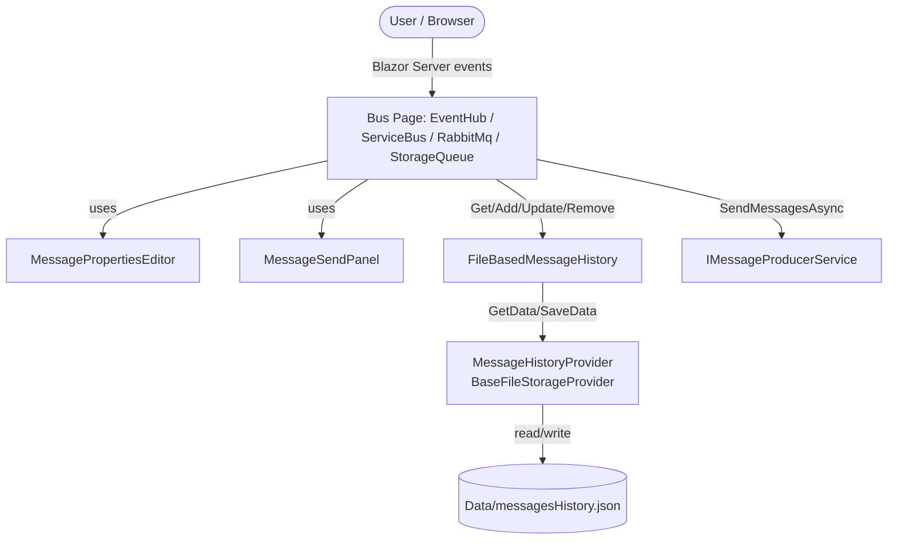
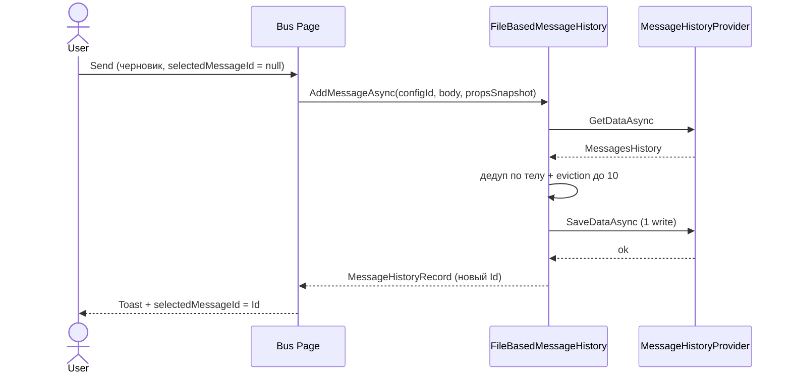
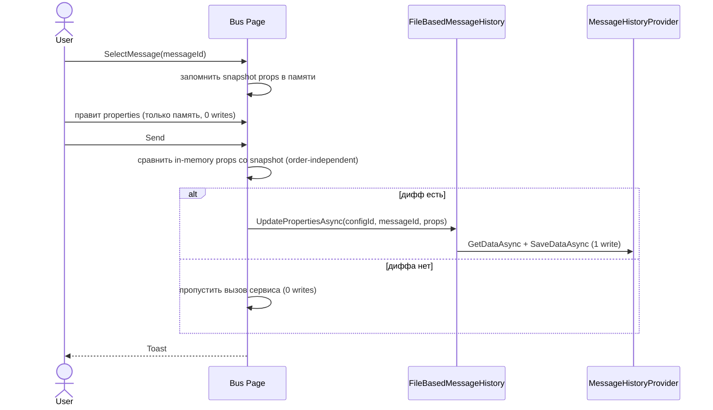
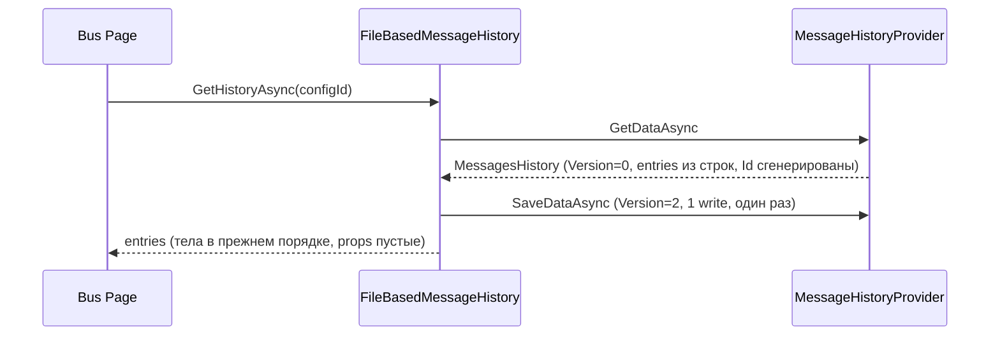
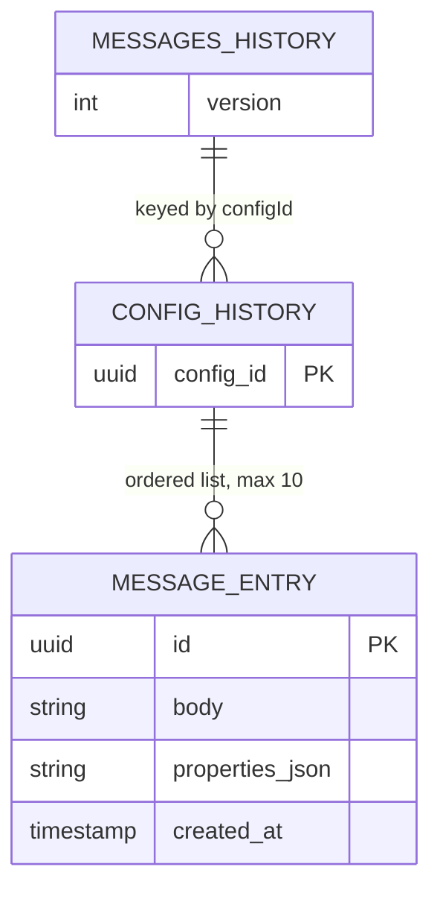

# Feature Specification: История метаданных сообщений (Properties) с привязкой к записи истории

---

## Document Metadata

| Field | Value |
|---|---|
| **Status** | Draft |
| **Version** | 0.1 |
| **Created** | 2026-09-06 |
| **Last Updated** | 2026-09-06 |
| **Related Docs** | `src/Domain/Models/MessagesHistory.cs`, `src/Domain/Models/OutgoingMessage.cs`, `src/Domain/Models/MessagePropertiesLimits.cs`, `src/Application/Services/FileBasedMessageHistory.cs`, `src/Infrastructure/Providers/FileStorageProviders/MessageHistoryProvider.cs`, `src/WebUI/Components/Shared/MessageSendPanel.razor`, `src/WebUI/Components/Shared/MessagePropertiesEditor.razor`, `src/WebUI/Components/Pages/EventHub.razor` (+ `ServiceBus.razor`, `RabbitMq.razor`, `StorageQueue.razor`) |

---

## 1. Executive Summary

Сейчас в файл `Data/messagesHistory.json` сохраняется только тело сообщения (`Dictionary<Guid, List<string>>`), а key-value свойства (`OutgoingMessage.Properties`) нигде не персистятся. Спецификация вводит вложенную сущность `MessageHistoryRecord` с собственным `Id`, в которой тело и снапшот properties хранятся вместе (связь 1:1 без отдельных словарей, индексов и ключей-по-телу). Старый формат файла однократно мигрируется в новый с сохранением всех тел (properties пустые), дальше все чтения идут в новом формате. Запись в файл происходит только в момент `Send`: для черновика — создание записи, для historic-записи — обновление только если properties реально изменились (поэлементное сравнение, order-independent). Правки в редакторе до `Send` живут только в памяти и в файл не пишутся.

---

## 2. Background & Context

### 2.1 Problem Statement

Пользователь формирует тело сообщения и набор properties в `MessagePropertiesEditor`, отправляет через любой из 4 провайдеров шин, но при следующем визите properties потеряны: история (`FileBasedMessageHistory`) хранит только `List<string>` тел. Повторный ввод properties вручную — потеря времени и источник ошибок.

### 2.2 Business Motivation

EventHubExplorer — внутренний инструмент для ручной отправки тестовых событий. Сохранение последнего снапшота properties на каждую historic-запись ускоряет повторные отправки и устраняет расхождение "тело из истории + properties по памяти".

### 2.3 Current State

- `MessagesHistory.Messages: Dictionary<Guid, List<string>>`, где ключ — Id конфига шины (параметр `Id` страниц). Отдельного Id у тела нет; identity тела сегодня — его значение (`Contains`/`Remove` по строке).
- Дубликаты тел запрещены (`EventHub.razor:189` — `!messagesHistoryList.Contains(messageToSend)`).
- Лимит — 10 записей на конфиг (`MAX_HISTORY_MESSAGES = 10`), вытеснение oldest-first (`RemoveFromHistory(messagesHistoryList[0])`).
- `MessageSendPanel` работает с `List<string>`, коллбеки `OnSelectMessage(string)` / `OnRemoveFromHistory(string)` — индекса нет.
- Файловый провайдер — один файл, `SemaphoreSlim` внутри `BaseFileStorageProvider`, дисковые операции: 1 read + ≤1 write на операцию.

### 2.4 Proposed Solution Overview

Заменить `List<string>` на `List<MessageHistoryRecord>` (`Id`, `Body`, `Properties`, `CreatedAt`) в том же файле и том же провайдере. Добавить `JsonConverter`, понимающий оба формата элементов (строка = legacy, объект = новый), и поле `Version` для однократной стабилизирующей записи после миграции. Сервисный интерфейс перевести с identity-по-значению на identity-по-`Id` с сохранением дедупа по телу как бизнес-правила. UI держит выбранную запись и её properties в памяти; сравнение перед записью исключает лишние write.

---

## 3. Goals & Non-Goals

### 3.1 Goals

| # | Goal | Success Metric                                                                                        |
|---|---|-------------------------------------------------------------------------------------------------------|
| G1 | Каждая historic-запись хранит последний отправленный снапшот properties (1:1, в том же файле) | После рестарта выбор записи подставляет тело и properties, совпадающие с моментом последнего `Send`   |
| G2 | Ноль записей в файл при редактировании черновика и при `Send` без изменений | Счётчик write-операций: черновик до `Send` — 0; `Send` без диффа properties — 0 writes для properties |
| G3 | Однократная миграция старого формата с сохранением тел и порядка | Старый JSON открывается, все тела на месте в том же порядке, второй запуск файла не переписывает      |
| G4 | Сохранение текущих гарантий: дедуп по телу, лимит 10, oldest-first eviction | Ручные тесты после завершения имплементации                                                           |

### 3.2 Non-Goals

- **История версий properties** — хранится только последний снапшот, не журнал правок (по требованию).
- **Типизированные значения properties** — редактор отдаёт `string`; в файле только `string`. Объектные типы `OutgoingMessage` (`byte[]`, `int`, `Guid`, …) вне скоупа.
- **Синхронизация между вкладками/процессами** — last-write-wins через существующий `SemaphoreSlim`; без merge.
- **Смена лимита 10 / рефакторинг дублирования 4-х pages** — не входит (лимит подтверждён, дедуп страниц — отдельная задача).
- **Шифрование файла истории** — тела считаются нетронутыми, без PII-гарантий сверх текущих.

---

## 4. User Personas & Stories

### 4.1 Personas

| Persona | Description | Frequency of use |
|---|---|---|
| **Тестировщик шин** | Вручную гоняет события в EventHub/ServiceBus/RabbitMQ/StorageQueue, подбирает properties | Daily |

### 4.2 User Stories

```
As a Тестировщик шин,
I want to выбрать тело из истории и получить его properties,
So that не вводить ключи заново.

Acceptance Criteria:
  - GIVEN запись с properties сохранена и приложение перезапущено,
    WHEN выбираю её из истории,
    THEN редактор показывает тело и properties из момента последнего Send.
```

```
As a Тестировщик шин,
I want to править properties черновика без записи в файл,
So that недописанные ключи не пачкают историю.

Acceptance Criteria:
  - GIVEN сообщение ещё ни разу не отправлено,
    WHEN добавляю/меняю/удаляю ключи,
    THEN файл истории не изменяется (mtime/size прежние) до нажатия Send.
```

```
As a Тестировщик шин,
I want to повторный Send без изменений не трогал файл,
So that не изнашивать диск и не триггерить вотчеры.

Acceptance Criteria:
  - GIVEN выбрана historic-запись и properties не менялись,
    WHEN нажимаю Send,
    THEN properties-блок файла байт-в-байт прежний.
```

```
As a Тестировщик шин,
I want to старая история тел сохранилась после обновления,
So that не потерять наработки.

Acceptance Criteria:
  - GIVEN файл в старом формате (массив строк),
    WHEN открываю страницу,
    THEN все тела на месте в прежнем порядке, properties пустые.
```

---

## 5. Functional Requirements

### 5.1 Модель и хранение

- `FR-001 [MUST]` The system SHALL хранить историю как `MessagesHistory { int Version = 2; Dictionary<Guid, List<MessageHistoryRecord>> Messages }`, где ключ — Id конфига шины.
- `FR-002 [MUST]` The system SHALL задавать запись как `MessageHistoryRecord { Guid Id; string Body; Dictionary<string,string> Properties; DateTimeOffset CreatedAt }`. `Id` генерируется один раз при создании.
- `FR-003 [MUST]` The system SHALL валидировать properties по `MessagePropertiesLimits` (пар ≤ 30, ключ ≤ 256, значение ≤ 256, ключ непустой, дубликатов ключей нет) на границе сервиса.
- `FR-004 [MUST]` The system SHALL хранить properties только как `string→string`; конвертация в `object` для `OutgoingMessage` происходит в момент отправки.

### 5.2 Сервисные операции

- `FR-010 [MUST]` The system SHALL предоставлять `GetHistoryAsync(configId) → IReadOnlyList<MessageHistoryRecord>` (копии, не внутренние ссылки), упорядоченные от старых к новым.
- `FR-011 [MUST]` The system SHALL предоставлять `AddMessageAsync(configId, body, properties?) → MessageHistoryRecord`: пустое/whitespace тело — no-op (возврат без записи, как сегодня в `BaseMessageProducer`); дедуп по точному совпадению тела (см. FR-030); eviction при достижении 10.
- `FR-012 [MUST]` The system SHALL предоставлять `UpdatePropertiesAsync(configId, messageId, properties)`: неизвестный `messageId` — no-op без исключения и без записи; пустые properties удаляют ключи записи (хранится пустой словарь, не `null`).
- `FR-013 [MUST]` The system SHALL предоставлять `RemoveMessageAsync(configId, messageId)` и `RemoveAllAsync(configId)`; удаление записи удаляет и её properties атомарно (одна запись — одна write-операция).
- `FR-014 [MUST]` The system SHALL выполнять каждую мутацию как один read-modify-write под существующим `SemaphoreSlim` провайдера.

### 5.3 UI-поведение (4 pages + `MessageSendPanel` + `MessagePropertiesEditor`)

- `FR-020 [MUST]` The system SHALL держать в странице `selectedMessageId: Guid?` и in-memory копию properties выбранной записи; правки редактора до `Send` меняют только память.
- `FR-021 [MUST]` The system SHALL при `SelectMessage(messageId)` подставлять тело и properties записи в редакторы.
- `FR-022 [MUST]` The system SHALL при `Send` резолвить цель так: (1) `selectedMessageId` существует → обновить эту запись; (2) иначе тело совпало с существующей записью → обновить её; (3) иначе создать новую. После обновления тела — удалить прочие записи с тем же телом (дедуп) и применить eviction до 10.
- `FR-023 [MUST]` The system SHALL при `Send` сравнивать properties поэлементно без учёта порядка и писать в файл только при диффе; при равенстве — ноль writes для properties.
- `FR-024 [MUST]` The system SHALL при удалении тела из истории (`OnRemoveFromHistory`) удалять запись по `Id`; очистка всего конфига удаляет все его записи.
- `FR-025 [SHOULD]` The system SHALL показывать в дропдауне истории превью тела (первые ~50 символов, как сегодня) без изменения компонента сверх замены `string` на запись.

### 5.4 Миграция

- `FR-030 [MUST]` The system SHALL читать оба формата элементов массива: JSON-строка (legacy) и JSON-объект (новый) через один `JsonConverter`.
- `FR-031 [MUST]` The system SHALL маппить legacy-строку в запись `{ Id = NewGuid(), Body = строка, Properties = {}, CreatedAt = время миграции }` с сохранением порядка; пустые/whitespace строки пропускать.
- `FR-032 [MUST]` The system SHALL после первой загрузки legacy-файла (`Version < 2` / отсутствует) один раз сохранить его в новом формате (`Version = 2`) для стабилизации `Id`; повторные загрузки файл не переписывают.
- `FR-034 [MUST]` The system SHALL перед миграционным save скопировать исходный файл в `messagesHistory.json.bak`, после успешной записи и контрольного чтения нового файла удалить `.bak`. При неуспехе записи/проверки показать пользователю ошибку и восстановить историю из .bak копии, `.bak` сохраняется, новый файл не считается валидным.
- `FR-033 [MUST]` The system SHALL при полностью битом JSON (не парсится даже конвертером) вернуть пустую историю, залогировать ошибку и НЕ затирать файл до первой успешной мутации.

---

## 6. Non-Functional Requirements

### 6.1 Performance

| Metric | Target | Measurement Method |
|---|---|---|
| Дисковые writes на правку черновика | 0 | Ручной тест: mtime файла до `Send` неизменен |
| Writes на `Send` без диффа properties | 0 для properties-блока (допустим 0 writes всего, если тело тоже без изменений) | Мок `IFileStorageProvider`, подсчёт `SaveDataAsync` |
| Writes на `Send` с диффом / новая запись | ≤ 1 `SaveDataAsync` | Мок провайдера |
| Чтение истории страницы | 1 `GetDataAsync`, p95 < 200мс при файле ≤ 1МБ | Замер в тесте/локально [ASSUMPTION: файл истории < 1МБ] |
| Сравнение properties | O(n), n ≤ 30 — пренебрежимо | Код-ревью |

### 6.2 Scalability

- Baseline: 4 типа шин × десятки конфигов × ≤ 10 записей. Рост на порядки не ожидается.
- Механизм: один JSON-файл; при росте числа конфигов сверх ~1000 рассмотреть шардирование — вне скоупа ([ASSUMPTION]).

### 6.3 Availability & Reliability

| Metric | Target |
|---|---|
| Потеря тел при миграции | 0 (все непустые строки переносятся в том же порядке) |
| Стабильность `Id` после миграции | 100% (один persist, дальше `Id` неизменны) |
| Коррупция файла при конкурентных записах | Исключена существующим `SemaphoreSlim` |

### 6.4 Security

- Аутентификация/авторизация: без изменений (локальный инструмент, Blazor Server).
- Файл истории может содержать тестовые пейлоады — секреты/токены в properties запрещены на уровне UI-подсказки `[SHOULD]`; логирование тел и значений properties запрещено (логировать только counts/ids).
- Валидация входных данных — allowlist по `MessagePropertiesLimits` на границе сервиса.

### 6.5 Accessibility

- Без изменений UI-структуры сверх замены типа элементов дропдауна; существующие `aria-label` сохранить.

### 6.6 Observability

- Logging (structured): `Getting message history {ConfigId}`, `Migrated legacy history {Configs},{Entries}`, `History write skipped (no diff) {ConfigId},{MessageId}` — без тел/значений.

---

## 7. Technical Architecture

### 7.1 System Context



### 7.2 Component Breakdown

| Component | Responsibility | Technology |
|---|---|---|
| `MessageHistoryRecord` | Запись истории: `Id/Body/Properties/CreatedAt` | C# / Domain |
| `MessagesHistory` | Корень файла: `Version + Dictionary<configId, List<Entry>>` | C# / Domain |
| `MessageHistoryRecordListConverter` | Чтение string+object, запись только object | `System.Text.Json` / Infrastructure |
| `FileBasedMessageHistory` | CRUD + no-diff сравнение + однократный persist миграции | C# / Application |
| Bus pages (4) | `selectedMessageId`, in-memory properties, hash-сравнение на `Send` | Blazor |
| `MessageSendPanel` | Дропдаун записей (`Id` + превью), коллбеки по `Id` | Blazor |

### 7.3 Key User Flow — Send новой записи



### 7.4 Key User Flow — Send historic-записи с hash-проверкой



### 7.5 Первая загрузка legacy-файла



### 7.6 Deployment Architecture

Без изменений: тот же процесс WebUI, тот же путь `Data/messagesHistory.json`. Миграция: копия в `messagesHistory.json.bak` → запись нового формата → контрольное чтение → удаление `.bak` (FR-034). Откат после удаления `.bak` невозможен by design; до удаления — восстановлением из `.bak`.

---

## 8. Data Model

### 8.1 Entity-Relationship Diagram



Физически: `Dictionary<Guid, List<MessageHistoryRecord>>` в одном JSON-документе.

### 8.2 Key Entities

#### `MessageHistoryRecord`

| Field | Type | Constraints | Description |
|---|---|---|---|
| `Id` | GUID | PK в пределах файла, NOT NULL | Стабильный идентификатор записи, генерируется при `Add`/миграции |
| `Body` | string | NOT NULL, non-whitespace | Тело сообщения |
| `Properties` | `Dictionary<string,string>` | ключи по `MessagePropertiesLimits`, NOT NULL (может быть пустым) | Последний отправленный снапшот |
| `CreatedAt` | DateTimeOffset | NOT NULL | Порядок создания; при миграции — время миграции с сохранением порядка списка |

#### `MessagesHistory`

| Field | Type | Constraints | Description |
|---|---|---|---|
| `Version` | int | NOT NULL, DEFAULT 2 | `0`/отсутствует = legacy; `< 2` триггерит однократный persist |
| `Messages` | `Dictionary<Guid, List<Entry>>` | ключ — Id конфига | Списки упорядочены старые→новые, длина ≤ 10 после мутаций |

### 8.3 Data Lifecycle

| Data Type | Retention Policy | Deletion Strategy |
|---|---|---|
| Записи истории | ≤ 10 на конфиг, indefinite иначе | Eviction oldest-first при `Add`; hard delete по `Id` / по конфигу |
| Legacy-бэкап | Только на время миграции | Создать `.bak` → записать новый формат → контрольное чтение → удалить `.bak` (FR-034) |

JSON нового формата:

```json
{
  "Version": 2,
  "Messages": {
    "<configId>": [
      { "Id": "<guid>", "Body": "hello", "Properties": { "k": "v" }, "CreatedAt": "2026-09-06T00:00:00Z" }
    ]
  }
}
```

---

## 9. API Design

Сервисная поверхность (внутренняя, DI), не HTTP. Существующий `IMessageHistory<Guid, List<string>>` удаляется сразу в том же PR (решение утверждено, OQ-1 закрыт); единственный потребитель — 4 pages — правится вместе с сервисом.

```csharp
Task<IReadOnlyList<MessageHistoryRecord>> GetHistoryAsync(Guid configId);
Task<MessageHistoryRecord?> AddMessageAsync(Guid configId, string body, IReadOnlyDictionary<string, string>? properties = null);
Task UpdatePropertiesAsync(Guid configId, Guid messageId, IReadOnlyDictionary<string, string> properties);
Task RemoveMessageAsync(Guid configId, Guid messageId);
Task RemoveAllAsync(Guid configId);
```

- `AddMessageAsync`: `Guid.Empty` или whitespace body → `null`, без записи. Возвращает созданную запись (для `selectedMessageId`).
- `UpdatePropertiesAsync`: неизвестный `configId`/`messageId` → no-op, без исключения. Все параметры валидируются (guard clauses).
- Сравнение на дифф — на стороне страницы перед вызовом (0 writes при равенстве) + повторная проверка внутри сервиса `[SHOULD]` как защита от дубля.
- События/шины сообщений: без изменений; `OutgoingMessage` строится из тела + `props.ToDictionary(kv => kv.Key, kv => (object)kv.Value)` как сегодня.

Ошибки:

| Ситуация | Поведение |
|---|---|
| `configId == Guid.Empty` | no-op / пустой результат, без записи |
| Тело пустое | no-op |
| Ключ/значение нарушают лимиты | `ArgumentException` с указанием ключа (не сырая IO-ошибка наружу) |
| Файл отсутствует | Пустая история (как сегодня) |
| Файл битый | Пустая история + error-лог, файл не затирается (FR-033) |

---

## 10. Security & Compliance

### 10.1 Authentication & Authorization

Без изменений.

### 10.2 Sensitive Data Handling

| Data Element | Classification | Storage                    | Transit | Access Control |
|---|---|----------------------------|---|---|
| Тело сообщения | Internal (тестовые данные) | JSON на диске, как сегодня | N/A (локально) | Процесс WebUI |
| Properties keys/values | Internal | JSON                       | N/A | Процесс WebUI |

Запрет: логировать тела и значения properties; писать сырые `IOException`/`JsonException` в UI-тосты (только дружелюбное сообщение + лог).

### 10.3 Threat Model

| Threat | Likelihood | Impact | Mitigation |
|---|---|---|---|
| Раздувание файла гигантскими телами/values | Low | Medium | Лимиты длин + максимум 10 записей; валидация до записи |
| Потеря истории при сбое mid-write | Low | Medium | Атомарная запись (`WriteAllTextAsync` под семафором, как сегодня) + `.bak` с удалением после успешной проверки (FR-034) |
| Коллизия сравнения (hash) | N/A | — | Решение: точное поэлементное сравнение вместо хеша — коллизий нет по построению |

### 10.4 Compliance Requirements

Нет регуляторных требований (внутренний инструмент). `[REQUIRES EXPERT REVIEW]` не требуется.

---

## 11. Error Handling & Edge Cases

| Scenario | Expected Behavior | User-Facing Message |
|---|---|---|
| Legacy-файл валиден | `.bak` → save `Version: 2` → контрольное чтение → удалить `.bak` (FR-034) | — (прозрачно) |
| Файл битый | Пустая история, error-лог, файл цел | "Message history unavailable, starting fresh." |
| `Send` с пустым телом | No-op (как сегодня) | — |
| Тело совпало с другой записью при обновлении выбранной | Обновить выбранную, удалить дубль с тем же телом | — |
| `Update/Remove` по несуществующему `Id` | No-op, без исключения | — |
| Лимит 10 достигнут при `Add` | Удалить oldest (индекс 0) вместе с properties, затем добавить | — |
| Параллельные записи из двух вкладок | Сериализация семафором, last-write-wins | — |
| Закрытие страницы после правок без `Send` | Правки теряются (by design, §5.3) | Подсказка в UI `[SHOULD]`: "Properties сохраняются при Send" |
| Properties нарушают лимиты | `ArgumentException`, запись отклонена | Текст валидации из редактора/сервиса |

---

## 12. Implementation Plan

Ограничения процесса: функции ≤ ~20 строк, ≤ 3 параметров, guard clauses, без `catch {}`, именования по стандартам репо, XML-доки публичных API.

**Milestone**: properties персистятся per-запись, миграция работает, 4 страницы на новом flow.

| Task                                                                                                                                                                | Owner | Effort | Dependencies |
|---------------------------------------------------------------------------------------------------------------------------------------------------------------------|---|---|---|
| Domain: `MessageHistoryRecord`, `MessagesHistory{Version}`, лимиты без изменений                                                                                    | Backend | S (1–2d) | Spec approved |
| Infrastructure: `MessageHistoryRecordListConverter` (string+object)                                                                                                 | Backend | S (1–2d) | Модель готова |
| Application: новый контракт (старый `IMessageHistory<Guid, List<string>>` удалить) + `FileBasedMessageHistory` (CRUD, сравнение, миграционный persist + `.bak` по FR-034) | Backend | M (3–4d) | Конвертер готов |
| WebUI: `MessageSendPanel` на записи+`Id`, 4 pages (`selectedMessageId`, in-memory props, сравнение на `Send`)                                                       | Frontend | M (3–4d) | Сервис готов |
| Руручные тест, приёмки                                                                                                                                              | Backend | S (1–2d) | Всё выше |

---

## 13. Risks & Mitigations

| Risk | Likelihood | Impact | Mitigation | Owner |
|---|---|---|---|---|
| Нестабильные `Id` если забыть persist после миграции | Low | High | FR-032 + интеграционный тест "второе чтение без write" | Backend |
| Смена контракта ломает 4 pages одновременно | Medium | Medium | Единый новый интерфейс + поочерёдная замена страниц, компиляция после каждой | Backend |
| Потеря несохранённых правок при закрытии (by design) | High (поведение) | Low | Подсказка в UI; поведение задокументировано в §11 | Frontend |
| Scope creep (типизация values, версионирование) | Medium | Medium | Non-Goals §3.2, гейт в Phase 2 | PM |

---

## 14. Open Questions

| # | Question | Owner | Due Date | Status |
|---|---|---|---|---|
| OQ-1 | Старый `IMessageHistory<Guid, List<string>>` удалить сразу или держать obsolete-адаптер? | Team | 2026-09-06 | Resolved: удалить сразу в том же PR |
| OQ-2 | Делать ли `.bak` перед миграционным save? | Team | 2026-09-06 | Resolved: да; после успешной записи и контрольного чтения `.bak` удаляется (FR-034) |

---

## 15. Glossary

| Term | Definition |
|---|---|
| Historic-запись | Запись истории с существующим `Id`, выбранная из дропдауна |
| Черновик | Тело+properties без `selectedMessageId`, ещё ни разу не отправленные |
| Снапшот properties | Копия `Dictionary<string,string>` на момент `Send`; перезаписывает предыдущую целиком |
| No-diff Send | `Send`, при котором properties побайтово/логически равны сохранённым — write пропускается |
| Legacy-формат | `Messages: {configId: [string]}` без `Version` |

---

## 16. References

- `src/Domain/Models/MessagesHistory.cs` — текущий корень истории
- `src/Domain/Models/OutgoingMessage.cs` — валидация properties как референс правил
- `src/Domain/Models/MessagePropertiesLimits.cs` — MaxPairs=30, MaxKeyLength=256, MaxValueLength=256
- `src/Application/Services/FileBasedMessageHistory.cs` — текущий CRUD
- `src/Infrastructure/Providers/FileStorageProviders/BaseFileStorageProvider.cs` — семафор, сериализация
- Обсуждение в чате 2026-09-06: решения «дедуп по телу», «обновить выбранную», «лимит 10», «сравнение в памяти на Send»

---

<!-- SELF-REVIEW LOG
Reviewed on: 2026-09-06
Checks performed:
  - Logical consistency: PASS (Non-Goals не противоречат Goals; FR-022 согласует дедуп-by-value с identity-by-Id; eviction описан один раз)
  - Completeness: PASS (каждая user story имеет критерии; каждый FR трассируется к story/goal; интеграции — провайдер и 4 pages — в диаграммах; error-пути в §11)
  - Accuracy / hallucination check: PASS (имена файлов и поля сверены с кодом выше; числовые цели помечены измерением; [ASSUMPTION] на размере файла и росте)
  - Diagram correctness: PASS (3 sequence + 1 context + 1 ER, стрелки подписаны, висячих узлов нет)
  - Actionability: PASS (методы сервиса с сигнатурами; приёмки измеримы; оценка T-shirt; MVP отделён от Polish)
Changes made during review:
  - Явно зафиксирован by-design нюанс потери несохранённых правок при закрытии + UI-подсказка SHOULD
  - Запрет логирования тел/значений вынесен в NFR и матрицу данных
  - OQ-1/OQ-2 закрыты решениями пользователя (2026-09-06): удаление старого интерфейса сразу; `.bak` с удалением после успешной проверки (FR-034)
-->
