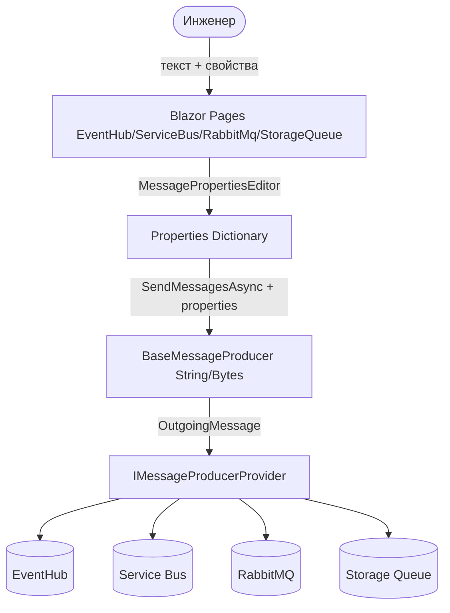
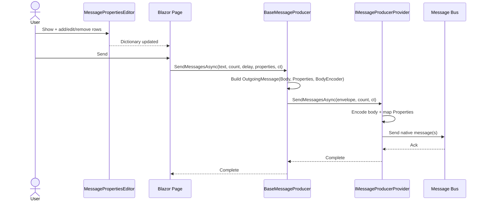
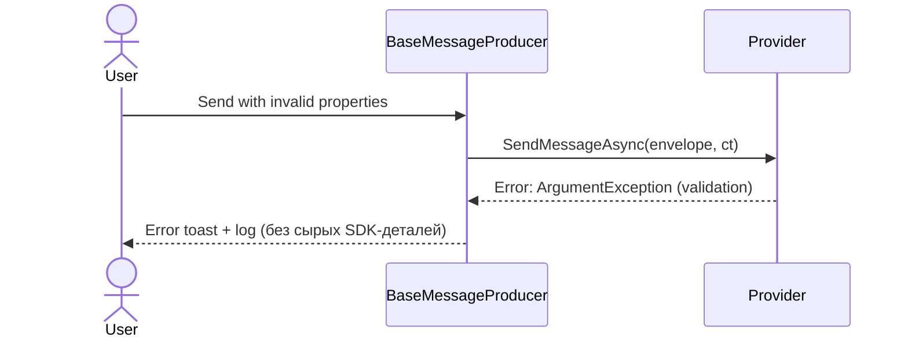
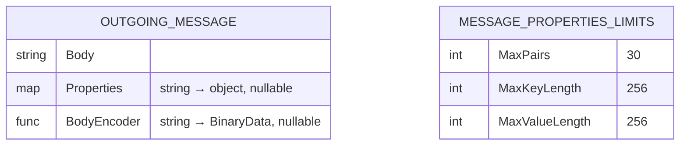

# Feature Specification: OutgoingMessage — Properties сообщений для всех шин

---

## Document Metadata

| Field | Value |
|---|---|
| **Status** | Approved |
| **Version** | 1.1 (OQ-1..OQ-3 resolved) |
| **Created** | 2026-09-04 |
| **Last Updated** | 2026-09-04 |
| **Related Docs** | `src/Domain/Interfaces/Providers/IMessageProducerProvider.cs`, `src/Infrastructure/Providers/EventHubProducerProvider.cs`, `src/Application/Services/MessageProducers/BaseMessageProducer.cs` |

---

## 1. Executive Summary

Продюсеры сообщений (`IMessageProducerProvider`) сегодня умеют отправлять только тело сообщения (`string` + `Func<string, BinaryData>`-модификатор) и не поддерживают пользовательские свойства (headers/properties). Требуется добавить возможность задавать `Properties` для `EventData`, сохранив шинно-независимый интерфейс, который переиспользуется четырьмя провайдерами (EventHub, ServiceBus, RabbitMQ, StorageQueue). Решение: ввести Domain-тип `OutgoingMessage` (immutable record: тело + `Properties` + опциональный энкодер тела) и перевести методы провайдера на приём этого объекта. Каждый провайдер маппит общие свойства на нативное поле своей шины; StorageQueue, не поддерживающий свойства, явно логирует warning и игнорирует их. Ввод свойств в UI — компактная сворачиваемая key-value таблица, переиспользуемая на всех страницах отправки. Старые перегрузки интерфейса сохраняются как `[Obsolete]`-шиммы на переходный период.

---

## 2. Background & Context

### 2.1 Problem Statement

`IMessageProducerProvider` (`src/Domain/Interfaces/Providers/IMessageProducerProvider.cs`) имеет три метода, принимающих `(string message, Func<string, BinaryData>? messageModifier, ...)`. Добавить `Properties` в `EventData` (`EventHubProducerProvider`) через этот интерфейс напрямую невозможно без нарушения его шинной нейтральности: у каждой шины метаданные называются и хранятся по-разному, а у StorageQueue их нет вообще.

### 2.2 Business Motivation

Инженеры, тестирующие интеграции через EventHubExplorer, не могут отправлять сообщения с кастомными свойствами (correlation id, content-type маркеры, маршрутизация), что блокирует отладку фильтров и роутинга на стороне потребителей. Сейчас подходящий момент, т.к. интерфейс уже нарушает стандарт «максимум 3 параметра» (4 параметра в двух методах) — рефакторинг закроет оба долга сразу.

### 2.3 Current State

Тело кодируется через `messageModifier`, создаваемый в `BaseMessageProducer.CreateMessageModifier()` из `MessageOptions` (gzip/base64, text pipeline). Провайдеры вызывают модификатор на каждое сообщение в цикле и строят нативный объект (`EventData`, `ServiceBusMessage`, `BinaryData` + publish, `QueueClient.SendMessageAsync`). Метаданных нет ни на одном уровне цепочки `Blazor page → IMessageProducerService → BaseMessageProducer → IMessageProducerProvider`.

### 2.4 Proposed Solution Overview

Ввести `Domain.Models.OutgoingMessage` — immutable record с полями `Body`, `Properties`, `BodyEncoder`. Изменить сигнатуры `IMessageProducerProvider` и `IMessageProducerService`/`BaseMessageProducer` на приём `OutgoingMessage`. Реализовать per-provider маппинг свойств. Валидацию выполнять на границе (конструктор record + провайдер), без утечки SDK-типов в Domain/Application. Лимиты (макс. 30 пар, ключ/значение ≤256 символов) централизовать в `MessagePropertiesLimits`, чтобы менялись в одном месте. Старые перегрузки оставить `[Obsolete]`-шиммами, делегирующими к новым методам.

---

## 3. Goals & Non-Goals

### 3.1 Goals

| # | Goal | Success Metric |
|---|---|---|
| G1 | Отправка `Properties` через EventHub (`EventData.Properties`) | Сообщение, отправленное с N свойствами, читается консумером с теми же N парами ключ-значение |
| G2 | Единый шинно-независимый контракт для всех 4 провайдеров | `IMessageProducerProvider` не ссылается на типы `Azure.*` / `RabbitMQ.*`; все 4 класса компилируются против одного интерфейса |
| G3 | Соблюдение стандартов кода (≤3 параметров на метод, иммутабельность, валидация на границе) | Каждый публичный метод провайдера имеет ≤3 параметров; входные словари не мутируются |
| G4 | Явное поведение StorageQueue при наличии свойств | При передаче непустых свойств пишется warning-лог; сообщение отправляется без свойств, без исключений |
| G5 | Компактный UI-редактор свойств на всех страницах отправки | По умолчанию таблица скрыта (show/hide); добавление/удаление/редактирование пар без перезагрузки; один переиспользуемый компонент |

### 3.2 Non-Goals

- **Тесты любого вида** — исключены по требованию заказчика; тестовые задачи в план не входят.
- **Новые виды метаданных** (`PartitionKey`, `SessionId`, `RoutingKey`, `ContentType`) — не вводятся; `OutgoingMessage` спроектирован так, чтобы их можно было добавить полями record без изменения интерфейса.
- **Consumer-сторона** — чтение/отображение свойств в UI получения сообщений не входит в scope.

---

## 4. User Personas & Stories

### 4.1 Personas

| Persona | Description | Frequency of use |
|---|---|---|
| **Инженер интеграции** | Отлаживает продюсеров/консумеров через EventHubExplorer, нужны кастомные свойства для фильтров | Daily |
| **Разработчик EventHubExplorer** | Поддерживает 4 провайдера, боится расхождения контрактов | Weekly |

### 4.2 User Stories

```
As a инженер интеграции,
I want to указать набор key-value свойств при отправке сообщения,
So that потребитель, фильтрующий по свойствам, получил их без изменения тела.

Acceptance Criteria:
  - GIVEN заполненные свойства, WHEN отправка через EventHub, THEN консумер видит те же пары ключ-значение.
  - GIVEN пустые/отсутствующие свойства, WHEN отправка, THEN поведение идентично текущему (только тело).
```

```
As a инженер интеграции,
I want to редактировать свойства в компактной таблице, скрытой по умолчанию,
So that панель отправки не загромождена, когда свойства не нужны.

Acceptance Criteria:
  - GIVEN страница отправки, WHEN она открыта, THEN редактор свойств свернут и таблица пуста.
  - GIVEN развернутый редактор, WHEN добавление/изменение/удаление строк, THEN словарь свойств обновляется без потери текста сообщения.
  - GIVEN >30 пар или ключ/значение >256 символов, WHEN попытка добавить, THEN строка отклоняется с понятным сообщением.
```

```
As a разработчик EventHubExplorer,
I want to единый Domain-тип сообщения вместо роста числа параметров,
So that добавление будущих полей не ломало интерфейс провайдера.

Acceptance Criteria:
  - GIVEN новый опциональный атрибут сообщения, WHEN он добавляется, THEN сигнатуры IMessageProducerProvider не меняются.
```

---

## 5. Functional Requirements

### 5.1 Core Flows

- `FR-001 [MUST]` The system SHALL предоставлять Domain-тип `OutgoingMessage` с полями `Body: string`, `Properties: IReadOnlyDictionary<string, object>?` (default null), `BodyEncoder: Func<string, BinaryData>?` (default null).
- `FR-002 [MUST]` The system SHALL принимать `OutgoingMessage` в `IMessageProducerProvider.SendMessageAsync`, `SendMessagesAsync`, `SendMessagesWithDelayAsync`. Каждый метод SHALL иметь не более 3 параметров.
- `FR-003 [MUST]` `EventHubProducerProvider` SHALL копировать каждую пару из `Properties` в `EventData.Properties` для каждого отправляемого события.
- `FR-004 [MUST]` `ServiceBusProducerProvider` SHALL копировать каждую пару из `Properties` в `ServiceBusMessage.ApplicationProperties`.
- `FR-005 [MUST]` `RabbitMqProducerProvider` SHALL копировать `Properties` в `BasicProperties.Headers` при публикации.
- `FR-006 [MUST]` `StorageQueueProducerProvider` SHALL игнорировать `Properties` и писать warning-лог при непустом словаре; отправка тела SHALL продолжаться без ошибок.
- `FR-007 [MUST]` `BaseMessageProducer` / `IMessageProducerService` SHALL принимать опциональные свойства per-send и собирать `OutgoingMessage`, используя существующий `CreateMessageModifier()` как `BodyEncoder`.
- `FR-008 [MUST]` The system SHALL валидировать на границе: `Body` не null; ключи свойств не null/не пустые/не whitespace; не более `MessagePropertiesLimits.MaxPairs` (30) пар; длина ключа и строкового значения не более `MessagePropertiesLimits.MaxKeyLength` / `MaxValueLength` (256); значения — только AMQP-совместимые типы (`string`, `byte[]`, `int`, `long`, `double`, `bool`, `Guid`, `DateTimeOffset`); нарушение SHALL приводить к `ArgumentException` до обращения к шине.
- `FR-009 [MUST]` Провайдеры SHALL NOT мутировать входной словарь `Properties` и SHALL NOT пробрасывать сырые SDK-исключения как есть — ошибки маппинга оборачиваются в `InvalidOperationException` с контекстом.
- `FR-011 [MUST]` Лимиты свойств SHALL быть централизованы в `Domain`-типе `MessagePropertiesLimits` (константы `MaxPairs = 30`, `MaxKeyLength = 256`, `MaxValueLength = 256`); валидация и UI SHALL читать лимиты только оттуда, чтобы изменение требовало правки одного места.
- `FR-012 [MUST]` Старые перегрузки `IMessageProducerProvider` `(string message, Func<string, BinaryData>?)` SHALL быть сохранены как `[Obsolete]`-шиммы на переходный период; каждый шимм SHALL делегировать новому методу, упаковывая аргументы в `OutgoingMessage` с `Properties: null`.

### 5.2 UI-редактор свойств

- `FR-010 [MUST]` WebUI SHALL предоставлять переиспользуемый Blazor-компонент `MessagePropertiesEditor` (таблица key-value): по умолчанию свернут (show/hide-переключатель) и пуст; поддерживает добавление, редактирование и удаление строк; таблица расширяется по мере добавления; биндится к словарю страницы и передает его в `IMessageProducerService`. Один и тот же компонент SHALL использоваться на всех 4 страницах отправки.
- `FR-013 [MUST]` Страница StorageQueue SHALL показывать под редактором статическую подсказку, что свойства не поддерживаются очередью и будут проигнорированы.

---

## 6. Non-Functional Requirements

### 6.1 Performance

| Metric | Target | Measurement Method |
|---|---|---|
| Доп. latency отправки 1 сообщения со свойствами (≤10 пар) | < 1 ms относительно baseline без свойств | Замер Stopwatch в ручном прогоне до/после |
| Аллокации на hot path | Без копирования тела; свойства копируются один раз в нативный объект | Код-ревью |

### 6.2 Scalability

Пакетная отправка (`SendMessagesAsync`) SHALL переиспользовать один encoder-вызов на сообщение как сегодня; свойства применяются внутри цикла без изменения батчинг-логики (`TryAdd` / пересоздание батча).

### 6.3 Availability & Reliability

Поведение при пустых свойствах SHALL быть бит-в-бит как текущее (регрессий отправки тела нет). Uptime SLO продукта не меняется данной фичей.

### 6.4 Security

- Свойства — пользовательский ввод: ключи/значения валидируются по allowlist типов (FR-008); не более 30 пар; длина ключа и строкового значения ≤256 символов (лимиты из `MessagePropertiesLimits`).
- SHALL NOT логировать значения свойств выше уровня Debug; warning для StorageQueue логирует только ключи/количество, не значения.
- Секреты в свойствах запрещены политикой использования (документировать в Glossary/Reference).

### 6.5 Accessibility

Редактор свойств SHALL быть keyboard-навигируемым (добавление/удаление строк без мыши); кнопки show/hide и delete SHALL иметь текстовые метки.

### 6.6 Observability

- Успешная отправка со свойствами логируется на Information с количеством свойств (без значений).
- Игнорирование свойств StorageQueue — Warning с именем очереди и количеством свойств.
- Ошибка валидации — Error с именем нарушенного правила, без дампа тела.

---

## 7. Technical Architecture

### 7.1 System Context



### 7.2 Component Breakdown

| Component | Responsibility | Technology |
|---|---|---|
| `OutgoingMessage` | Immutable envelope: тело + свойства + энкодер; валидация | C# record, `src/Domain/Models/` |
| `MessagePropertiesLimits` | Централизованные лимиты (30 пар, 256 символов) | C# static class, `src/Domain/Models/` |
| `IMessageProducerProvider` | Шинно-независимый контракт отправки (3 новых метода + 3 `[Obsolete]`-шимма) | C# interface, Domain |
| `BaseMessageProducer<T>` | Сборка envelope из текста + `MessageOptions` + per-send свойств | C# abstract class, Application |
| `EventHub/ServiceBus/RabbitMq/StorageQueueProducerProvider` | Маппинг `Properties` на нативное поле шины | C# sealed class, Infrastructure |
| `MessagePropertiesEditor` | Сворачиваемая key-value таблица (add/update/remove) | Razor component, WebUI shared |
| Blazor pages | Хранение словаря свойств, проброс в сервис | Razor, WebUI |

### 7.3 Key User Flow — отправка со свойствами



### 7.4 Error Flow — невалидные свойства



### 7.5 Deployment Architecture

Без изменений: те же контейнеры/эмуляторы (`compose.yaml`), новые зависимости отсутствуют, версии Azure SDK / RabbitMQ.Client не меняются.

---

## 8. Data Model

### 8.1 Entity-Relationship Diagram

Сущностей БД нет. Модель — in-memory envelope:



### 8.2 Key Entities

#### `OutgoingMessage` (`src/Domain/Models/OutgoingMessage.cs`, новый файл)

| Field | Type | Constraints | Description |
|---|---|---|---|
| `Body` | `string` | NOT NULL | Исходный текст до энкодинга |
| `Properties` | `IReadOnlyDictionary<string, object>?` | NULL = без свойств; ≤30 пар; ключи 1–256 символов, не whitespace; строковые значения ≤256 символов; значения из allowlist типов | Общие свойства, маппятся на нативное поле шины |
| `BodyEncoder` | `Func<string, BinaryData>?` | NULL = `BinaryData.FromString(Body)` | Существующая логика gzip/base64/pipeline из `BaseMessageProducer` |

#### `MessagePropertiesLimits` (`src/Domain/Models/MessagePropertiesLimits.cs`, новый файл)

| Field | Type | Value | Description |
|---|---|---|---|
| `MaxPairs` | `const int` | 30 | Максимум пар key-value на сообщение |
| `MaxKeyLength` | `const int` | 256 | Максимум символов ключа |
| `MaxValueLength` | `const int` | 256 | Максимум символов строкового значения |

Маппинг:

| Провайдер | Нативное поле | Реализация |
|---|---|---|
| EventHub | `EventData.Properties.TryAdd(k, v)` | Цикл по `Properties` на каждое событие |
| ServiceBus | `ServiceBusMessage.ApplicationProperties.TryAdd(k, v)` | Цикл на каждое сообщение |
| RabbitMQ | `BasicProperties.Headers[k] = v` | Словарь `IDictionary<string, object?>`, копия на публикацию |
| StorageQueue | — | Warning + игнорирование |

### 8.3 Data Lifecycle

`OutgoingMessage` живёт в рамках одного вызова отправки; персистентности и retention нет; словарь SHALL рассматриваться как immutable после создания (провайдеры копируют, не хранят ссылку). Словарь UI-страницы живёт пока открыта страница и очищается вместе с ней.

---

## 9. API Design

### 9.1 `IMessageProducerProvider` (новая версия)

```csharp
Task SendMessageAsync(OutgoingMessage message, CancellationToken cancellationToken = default);
Task SendMessagesAsync(OutgoingMessage message, uint numberOfMessages = 1, CancellationToken cancellationToken = default);
Task SendMessagesWithDelayAsync(OutgoingMessage message, uint numberOfMessages = 1, TimeSpan sendDelay = default, CancellationToken cancellationToken = default);

[Obsolete("Use the OutgoingMessage overload. Will be removed in a future release.")]
Task SendMessageAsync(string message, Func<string, BinaryData>? messageModifier = null, CancellationToken cancellationToken = default);
// ... аналогичные Obsolete-шиммы для SendMessagesAsync / SendMessagesWithDelayAsync
```

Старые перегрузки сохраняются как `[Obsolete]`-шиммы на переходный период; каждый шимм упаковывает `(message, messageModifier)` в `OutgoingMessage` с `Properties: null` и делегирует новому методу. Внутренние call sites (`BaseMessageProducer` + страницы) переводятся на новые методы сразу; удаление шиммов — отдельным решением вне scope.

### 9.2 `IMessageProducerService` / `BaseMessageProducer`

```csharp
Task SendMessagesAsync(string? messageText, uint numberOfMessages = 1, TimeSpan? delayToSend = null, IReadOnlyDictionary<string, object>? properties = null, CancellationToken cancellationToken = default);
```

`BaseMessageProducer` собирает `new OutgoingMessage(messageText, properties, CreateMessageModifier())` и диспетчит на один из трёх методов провайдера по `numberOfMessages`/`delayToSend` как сегодня.

### 9.3 `OutgoingMessage` (эскиз)

```csharp
public sealed record OutgoingMessage(
    string Body,
    IReadOnlyDictionary<string, object>? Properties = null,
    Func<string, BinaryData>? BodyEncoder = null);
```

Валидация в конструкторе через `MessagePropertiesLimits`: `ArgumentNullException` при `Body is null`; `ArgumentException` при плохих ключах/типах/лимитах значений.

### 9.4 `MessagePropertiesEditor` (Blazor, новый shared-компонент)

- Параметры: `Value: IDictionary<string,string>`, `ValueChanged`, `IsExpanded` (default `false`), заголовок-счетчик.
- Поведение: toggle show/hide; строки key/value с кнопками add/remove; inline-валидация длины (256) и лимита строк (30) с сообщениями; пустое начальное состояние.
- Значения в UI — строки; типизация не требуется (шины принимают string напрямую, FR-008 покрывает string-ветку).

### 9.5 Events / Messages

Без изменений в брокерных топологиях; payload событий пополняется пользовательскими свойствами прозрачно для существующих консумеров (консумеры без чтения свойств продолжают видеть только тело).

---

## 10. Security & Compliance

### 10.1 Authentication & Authorization

Без изменений; используются существующие connection strings/конфиги (`EventHubConfig`, `ServiceBusConfig`, `RabbitMqConfig`, `StorageQueueConfig`).

### 10.2 Sensitive Data Handling

| Data Element | Classification | Storage | Transit | Access Control |
|---|---|---|---|---|
| Значения `Properties` | Internal (пользовательские) | Не хранятся | TLS (AMQP/HTTPS шины) | Тот же доступ, что к отправке сообщений |
| Тело сообщения | Internal | Не хранится | TLS | Тот же доступ |

### 10.3 Threat Model

| Threat | Likelihood | Impact | Mitigation |
|---|---|---|---|
| Инъекция через свойства (oversized keys, неожиданные типы → падение SDK) | Medium | Medium | Allowlist типов + лимиты 30/256 из `MessagePropertiesLimits`, валидация до вызова SDK |
| Утечка секретов через логирование свойств | Low | High | Логировать только количество/ключи, значения — только Debug и никогда в Warning/Error |
| DoS огромным словарём свойств | Low | Medium | Лимит 30 пар + 256 символов значения, проверка в UI и на границе |

### 10.4 Compliance Requirements

Нерегулируемая внутренняя тулза; дополнительных compliance-требований нет.

---

## 11. Error Handling & Edge Cases

| Scenario | Expected Behavior | User-Facing Message |
|---|---|---|
| `Properties` null или пусто | Обычная отправка только тела (как сегодня) | — (transparent) |
| Пустой/whitespace ключ, null-ключ | `ArgumentException` до вызова шины | "Invalid message property: key must be a non-empty string." |
| Значение недопустимого типа | `ArgumentException` с именем ключа и ожидаемыми типами | "Property '{key}' has unsupported type '{type}'." |
| >30 пар / ключ >256 / строковое значение >256 | `ArgumentException` (UI также блокирует inline) | "Too many properties (max 30)." / "Property key too long (max 256)." / "Property value too long (max 256)." |
| Дублирующийся ключ в редакторе | Inline-ошибка, строка не добавляется | "Duplicate key." |
| Свойство не влезает в batch (`TryAdd` false из-за размера) | Та же логика разбиения батча, что для тела | — (transparent) |
| StorageQueue + непустые свойства | Warning-лог (ключи, без значений) + отправка тела; подсказка под редактором | Toast успеха; hint: "Storage Queue does not support properties — they will be ignored." |
| `BodyEncoder` кидает исключение | Проброс без обёртки (логика кодирования — ответственность Application) | Существующий текст ошибки кодирования |
| Вызов старого `[Obsolete]`-метода | Warning компилятора + поведение как отправка без свойств | — (transparent) |

---

## 13. Implementation Plan

### Phase 1 — Domain контракт (est. S)

**Milestone**: `OutgoingMessage`, лимиты и новый `IMessageProducerProvider` компилируются; старые вызовы работают через шиммы.

| Task | Owner | Effort | Dependencies |
|---|---|---|---|
| Создать `src/Domain/Models/OutgoingMessage.cs` (record + валидация через лимиты) | Backend | S | — |
| Создать `src/Domain/Models/MessagePropertiesLimits.cs` (`MaxPairs=30`, `MaxKeyLength=256`, `MaxValueLength=256`) | Backend | XS | — |
| Добавить 3 новых метода в `IMessageProducerProvider`; старые оставить `[Obsolete]`-шиммами с делегированием | Backend | S | `OutgoingMessage` готов |

### Phase 2 — Провайдеры (est. M)

**Milestone**: Все 4 провайдера маппят свойства.

| Task | Owner | Effort | Dependencies |
|---|---|---|---|
| `EventHubProducerProvider`: helper `ApplyProperties(EventData, Properties)` + использование во всех 3 методах | Backend | S | Phase 1 |
| `ServiceBusProducerProvider`: helper для `ApplicationProperties` × 3 метода | Backend | S | Phase 1 |
| `RabbitMqProducerProvider`: `Headers` × 3 метода | Backend | S | Phase 1 |
| `StorageQueueProducerProvider`: warning + игнор × 3 метода | Backend | XS | Phase 1 |

### Phase 3 — Application + WebUI (est. M)

**Milestone**: Свойства доходят от UI до шины end-to-end.

| Task | Owner | Effort | Dependencies |
|---|---|---|---|
| `IMessageProducerService` + `BaseMessageProducer`: параметр `properties`, сборка envelope | Backend | S | Phase 2 |
| Новый shared-компонент `MessagePropertiesEditor` (show/hide, add/update/remove, inline-валидация 30/256) | Fullstack | S | `MessagePropertiesLimits` готов |
| Подключить редактор на 4 страницах отправки + hint на StorageQueue; перевести страницы на новые методы | Fullstack | S | Компонент + Application готовы |

### Effort Legend

| Label | Range |
|---|---|
| XS | < 1 day |
| S | 1–2 days |
| M | 3–4 days |
| L | 5–8 days |
| XL | > 8 days (consider breaking down) |

---

## 14. Risks & Mitigations

| Risk | Likelihood | Impact | Mitigation | Owner |
|---|---|---|---|---|
| Типы значений, допустимые в EventHub vs ServiceBus vs RabbitMQ, различаются | Medium | Medium | Allowlist = пересечение множеств; спорные типы (float, DateTime) запретить изначально, расширить позже | Backend |
| RabbitMQ `Headers` требует `object?` и особой сериализации сложных типов | Medium | Low | UI передает только string; провайдер принимает скаляры из allowlist; сложное — отклонить с понятной ошибкой | Backend |
| Внешние потребители `IMessageProducerProvider` вне решения сломаются | Low | High | Решение принято: старые перегрузки остаются `[Obsolete]`-шиммами; удаление — отдельным релизом | Backend |
| Рост batch-размера из-за свойств чаще триггерит разбиение батчей | Low | Low | Логика `TryAdd`/пересоздания батча уже существует и переиспользуется без изменений | Backend |
| Дубли ключей при ручном вводе в таблице | Low | Low | Inline-валидация в `MessagePropertiesEditor` + серверная валидация на границе | Fullstack |

---

## 15. Open Questions

| # | Question | Owner | Due Date | Status |
|---|---|---|---|---|
| OQ-1 | Формат ввода свойств в Blazor | UX / Backend | — | ✅ Resolved: переиспользуемая key-value таблица `MessagePropertiesEditor`, по умолчанию свернута (show/hide) и пуста; add/update/remove строк; FR-010 |
| OQ-2 | Точные лимиты | Backend | — | ✅ Resolved: макс. 30 пар, ключ/значение ≤256 символов; централизовано в `MessagePropertiesLimits`; FR-011 |
| OQ-3 | Судьба старых перегрузок | Backend | — | ✅ Resolved: сохранить как `[Obsolete]`-шиммы с делегированием; FR-012 |

---

## 16. Glossary

| Term | Definition |
|---|---|
| `OutgoingMessage` | Immutable Domain-envelope исходящего сообщения: тело + общие свойства + энкодер тела |
| `BodyEncoder` | `Func<string, BinaryData>` из `BaseMessageProducer` (gzip/base64/text pipeline); применяется провайдером к `Body` |
| `Properties` | Общие key-value метаданные; маппятся на `EventData.Properties` / `ApplicationProperties` / `Headers`; StorageQueue их не поддерживает |
| `MessagePropertiesLimits` | Централизованные лимиты (30 пар, ключ/значение ≤256); единственный файл для изменения лимитов |
| `MessagePropertiesEditor` | Shared Blazor-компонент: сворачиваемая key-value таблица для ввода свойств |
| Envelope | Объект, объединяющий тело и метаданные в один параметр вместо роста числа аргументов |

---

## 17. References

- `src/Domain/Interfaces/Providers/IMessageProducerProvider.cs` — текущий контракт (3 метода, `messageModifier`)
- `src/Infrastructure/Providers/EventHubProducerProvider.cs` — создание `EventData`, точка внедрения `Properties`
- `src/Infrastructure/Providers/ServiceBusProducerProvider.cs`, `RabbitMqProducerProvider.cs`, `StorageQueueProducerProvider.cs` — остальные маппинги
- `src/Application/Services/MessageProducers/BaseMessageProducer.cs` — сборка модификатора, диспетч single/batch/delayed
- Azure SDK: `EventData.Properties`, `ServiceBusMessage.ApplicationProperties` — `IDictionary<string, object>` с AMQP-ограничениями типов
- RabbitMQ.Client: `IBasicProperties.Headers` — `IDictionary<string, object?>`

---

<!--
SELF-REVIEW LOG
Reviewed on: 2026-09-04
Checks performed:
  - Logical consistency: PASS (Non-Goals не противоречат Goals; StorageQueue-исключение явно проведено через G4/FR-006/риски)
  - Completeness: PASS (каждая user story имеет acceptance criteria; каждый FR трассируется к цели; интеграции 4 шин отражены в диаграмме)
  - Accuracy / hallucination check: PASS (названия файлов/классов сверены с репозиторием; числовые цели помечены [ASSUMPTION] где не подтверждены; тесты полностью исключены по требованию)
  - Diagram correctness: PASS (Mermaid graph/sequence/erDiagram без висячих узлов; error flow отделён от happy path)
  - Actionability: PASS (задачи разбиты на 3 фазы с оценками XS–M, без тестовых задач)
Changes made during review:
  - Удалены все тестовые разделы и задачи (требование заказчика)
  - Добавлены OQ-1..OQ-3 вместо догадок о UI-формате и лимитах
  - Уточнено логирование: значения свойств не пишутся выше Debug

Reviewed on: 2026-09-04 (v1.1)
Checks performed:
  - Logical consistency: PASS (G5/FR-010/FR-013 согласованы; Non-Goals обновлены — UI-редактор в scope)
  - Completeness: PASS (OQ-1..OQ-3 закрыты решениями, трассированы к FR-010/FR-011/FR-012/FR-013)
  - Accuracy: PASS (лимиты 30/256 зафиксированы везде одинаково: FR-008, 6.4, 8.2, 10.3, 11, план)
  - Actionability: PASS (план дополнен задачами: MessagePropertiesLimits, Obsolete-шиммы, MessagePropertiesEditor)
Changes made during review:
  - OQ-1: добавлен FR-010 (MessagePropertiesEditor, show/hide, add/update/remove) + FR-013 (hint на StorageQueue) + user story
  - OQ-2: добавлен FR-011 (MessagePropertiesLimits), лимиты 30/256 зафиксированы во всех разделах
  - OQ-3: добавлен FR-012 (Obsolete-шиммы с делегированием), риск внешних потребителей закрыт
-->
