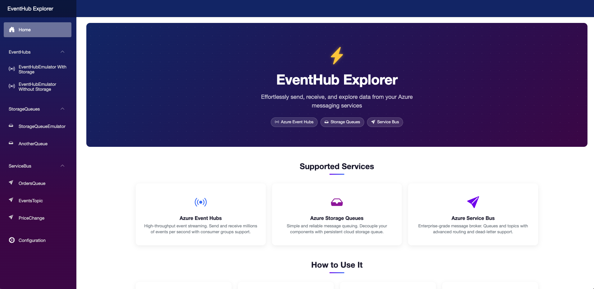
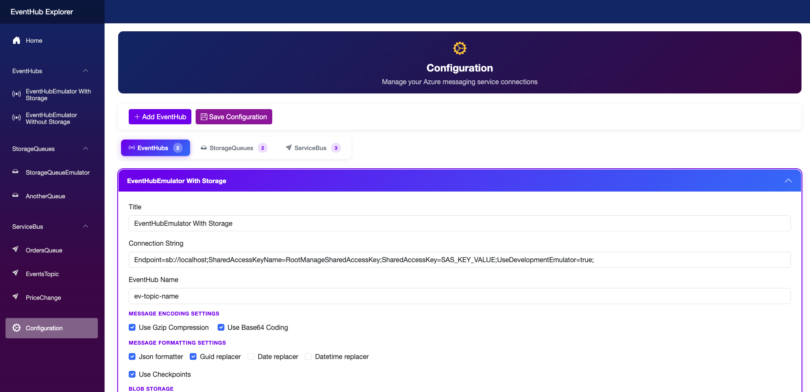
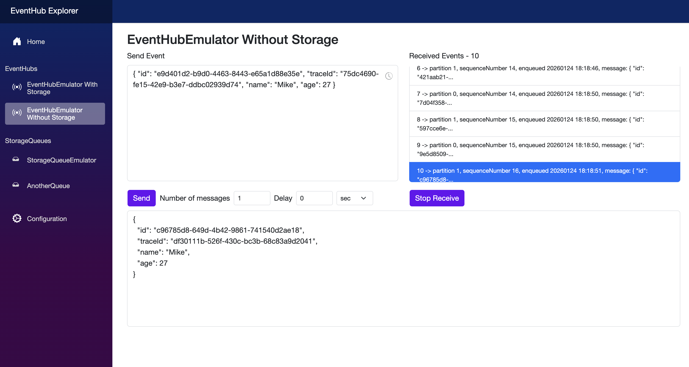

# EventHub Explorer


EventHub Explorer is a developer tool that allows you to interact with Azure Event Hubs, 
Azure Storage Queues and Azure Service Bus using a graphical user interface.
It supports real Azure services, and
the [eventhubs-emulator](https://learn.microsoft.com/en-us/azure/event-hubs/overview-emulator)
for Event Hubs,
the [Azurite](https://learn.microsoft.com/en-us/azure/storage/common/storage-use-azurite)
for StorageQueue,
the [Service Bus emulator](https://learn.microsoft.com/en-us/azure/service-bus-messaging/overview-emulator)
for Service Bus.







## Features

### Sending Messages to Event Hubs

* Override GUID, DateTime values in a message before sending
* Ability to compress and encode a message before sending
* Send a **single message**
* Send a **batch of messages**
* Send a **batch of messages** with a **time delay** between each message

### Receiving Messages from Event Hubs

* Format a message to JSON if it is a JSON string
* Ability to decompress and decode a message after receiving
* Receive messages **without checkpoints** (always fetch the newest messages, if is not yet received another consumer)
* Receive messages **with checkpoints** (using external storage to track received message IDs)

> Note: The application uses the `$Default` consumer group by default.

### Sending Messages to Storage Queues

* Override GUID, DateTime values in a message before sending
* Ability to compress and encode a message before sending
* Send a **single message**
* Send a **batch of messages**
* Send a **batch of messages** with a **time delay** between each message

### Receiving Messages from Storage Queues

* Format a message to JSON if it is a JSON string
* Ability to decompress and decode a message after receiving

### Sending Messages to Service Bus

* Override GUID, DateTime values in a message before sending
* Ability to compress and encode a message before sending
* Send a **single message**
* Send a **batch of messages**
* Send a **batch of messages** with a **time delay** between each message
* Supports both **Queue** and **Topic** entity types

### Receiving Messages from Service Bus

* Format a message to JSON if it is a JSON string
* Ability to decompress and decode a message after receiving
* Receive messages from a **Queue** or a **Topic Subscription**


## Example Connection Strings

### Event Hubs Emulator

The Event Hubs emulator uses a static connection string. The host value depends on how your application is deployed relative to the emulator.

**Application running natively on the same local machine as the emulator:**
```
Endpoint=sb://localhost;SharedAccessKeyName=RootManageSharedAccessKey;SharedAccessKey=SAS_KEY_VALUE;UseDevelopmentEmulator=true;
```

**Application on a different machine on the same local network** (use the IPv4 address of the machine running the emulator):
```
Endpoint=sb://192.168.x.y;SharedAccessKeyName=RootManageSharedAccessKey;SharedAccessKey=SAS_KEY_VALUE;UseDevelopmentEmulator=true;
```

**Application container on the same Docker bridge network** (use the emulator container alias, default is `eventhubs-emulator`):
```
Endpoint=sb://eventhubs-emulator;SharedAccessKeyName=RootManageSharedAccessKey;SharedAccessKey=SAS_KEY_VALUE;UseDevelopmentEmulator=true;
```

**Application container on a different Docker bridge network:**
```
Endpoint=sb://host.docker.internal;SharedAccessKeyName=RootManageSharedAccessKey;SharedAccessKey=SAS_KEY_VALUE;UseDevelopmentEmulator=true;
```

### Real Azure Event Hubs

**Namespace-level connection string** (access to all event hubs in the namespace):
```
Endpoint=sb://<NamespaceName>.servicebus.windows.net/;SharedAccessKeyName=<KeyName>;SharedAccessKey=<KeyValue>
```

**Event hub-level connection string** (access to a specific event hub):
```
Endpoint=sb://<NamespaceName>.servicebus.windows.net/;SharedAccessKeyName=<KeyName>;SharedAccessKey=<KeyValue>;EntityPath=<EventHubName>
```

---

### Azurite Blob Storage (Emulator)

The default well-known account for Azurite:
- Account name: `devstoreaccount1`
- Account key: `Eby8vdM02xNOcqFlqUwJPLlmEtlCDXJ1OUzFT50uSRZ6IFsuFq2UVErCz4I6tq/K1SZFPTOtr/KBHBeksoGMGw==`

**Running locally (localhost):**
```
DefaultEndpointsProtocol=http;AccountName=devstoreaccount1;AccountKey=Eby8vdM02xNOcqFlqUwJPLlmEtlCDXJ1OUzFT50uSRZ6IFsuFq2UVErCz4I6tq/K1SZFPTOtr/KBHBeksoGMGw==;BlobEndpoint=http://127.0.0.1:10000/devstoreaccount1;
```

**Running as a Docker container on the same bridge network** (use the Azurite container service name, e.g. `azurite`):
```
DefaultEndpointsProtocol=http;AccountName=devstoreaccount1;AccountKey=Eby8vdM02xNOcqFlqUwJPLlmEtlCDXJ1OUzFT50uSRZ6IFsuFq2UVErCz4I6tq/K1SZFPTOtr/KBHBeksoGMGw==;BlobEndpoint=http://azurite:10000/devstoreaccount1;
```

**Shortcut** (when running locally without Docker):
```
UseDevelopmentStorage=true
```

### Azurite Storage Queue (Emulator)

**Running locally (localhost):**
```
DefaultEndpointsProtocol=http;AccountName=devstoreaccount1;AccountKey=Eby8vdM02xNOcqFlqUwJPLlmEtlCDXJ1OUzFT50uSRZ6IFsuFq2UVErCz4I6tq/K1SZFPTOtr/KBHBeksoGMGw==;QueueEndpoint=http://127.0.0.1:10001/devstoreaccount1;
```

**Running as a Docker container on the same bridge network** (use the Azurite container service name, e.g. `azurite`):
```
DefaultEndpointsProtocol=http;AccountName=devstoreaccount1;AccountKey=Eby8vdM02xNOcqFlqUwJPLlmEtlCDXJ1OUzFT50uSRZ6IFsuFq2UVErCz4I6tq/K1SZFPTOtr/KBHBeksoGMGw==;QueueEndpoint=http://azurite:10001/devstoreaccount1;
```

### Real Azure Storage Queue

```
DefaultEndpointsProtocol=https;AccountName=<AccountName>;AccountKey=<AccountKey>;QueueEndpoint=https://<AccountName>.queue.core.windows.net;
```

---

### Service Bus Emulator

The Service Bus emulator uses a static connection string. The host value depends on how your application is deployed relative to the emulator.

**Application running natively on the same local machine as the emulator:**
```
Endpoint=sb://localhost;SharedAccessKeyName=RootManageSharedAccessKey;SharedAccessKey=SAS_KEY_VALUE;UseDevelopmentEmulator=true;
```

**Application on a different machine on the same local network** (use the IPv4 address of the machine running the emulator):
```
Endpoint=sb://192.168.x.y;SharedAccessKeyName=RootManageSharedAccessKey;SharedAccessKey=SAS_KEY_VALUE;UseDevelopmentEmulator=true;
```

**Application container on the same Docker bridge network** (use the emulator container alias, default is `servicebus-emulator`):
```
Endpoint=sb://servicebus-emulator;SharedAccessKeyName=RootManageSharedAccessKey;SharedAccessKey=SAS_KEY_VALUE;UseDevelopmentEmulator=true;
```

**Application container on a different Docker bridge network:**
```
Endpoint=sb://host.docker.internal;SharedAccessKeyName=RootManageSharedAccessKey;SharedAccessKey=SAS_KEY_VALUE;UseDevelopmentEmulator=true;
```

> **Note:** For management operations (creating/deleting entities via the Administration Client), append port `5300` to the connection string. Example for local machine:
> ```
> Endpoint=sb://localhost:5300;SharedAccessKeyName=RootManageSharedAccessKey;SharedAccessKey=SAS_KEY_VALUE;UseDevelopmentEmulator=true;
> ```

### Real Azure Service Bus

**Namespace-level connection string:**
```
Endpoint=sb://<NamespaceName>.servicebus.windows.net/;SharedAccessKeyName=<KeyName>;SharedAccessKey=<KeyValue>
```


## Requirements

* Docker
* Azure Event Hubs*
* Blob Storage* 
* Storage Queue*
* Service Bus*
  
`*`- the service you want to use

## Install options

1. Option 1
* Clone solution from the repo
* Build and Run the solution locally
* Open in browser http://localhost:5235/

2. Option 2
* Pull and Run docker image ```docker pull dvlaskin/eventhubexplorer```
* Open in browser http://localhost:5235/

Example of a docker compose file
```
services:

  eventhubexplorer:
    image: dvlaskin/eventhubexplorer:latest
    container_name: eventhubexplorer
    ports:
      - "5235:8080"
    volumes:
      - data-volume:/app/Data
    networks:
      - docker-network
        
volumes:
  data-volume:
    
networks:
  docker-network:
    external: true

```

## Support the Project

If you find **EventHub Explorer** useful in your day-to-day development workflow, consider giving it a ⭐ star on GitHub.

It takes just a second, but it means a lot — it helps me understand that the tool is being used and motivates me to keep improving it with new features and fixes.

> Your star is the best signal that this project is worth continuing. Thank you!

## License

MIT