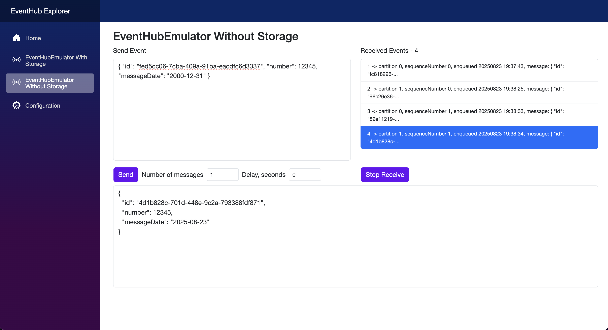

# EventHub Explorer

**EventHub Explorer** is a .Net Blazor application for interacting with the Azure Event Hub service. It supports both real Azure Event Hubs and the [eventhubs-emulator](https://learn.microsoft.com/en-us/azure/event-hubs/overview-emulator).





## Features

### Sending Messages to Event Hub

* Send a **single message**
* Send a **batch of identical messages**
* Send a **batch of identical messages** with a **time delay** between each message

### Receiving Messages from Event Hub

* Receive messages **without checkpoints** (always fetch the newest messages)
* Receive messages **with checkpoints** (using external storage to track received message IDs)

> Note: The application uses the `$Default` consumer group by default.

## Example Connection Strings

### EventHub Emulator

```
Endpoint=sb://eventhub-docker;SharedAccessKeyName=RootManageSharedAccessKey;SharedAccessKey=SAS_KEY_VALUE;UseDevelopmentEmulator=true;
```

> `eventhub-docker` is the Docker service name of the Event Hub emulator running in the same Docker network.

### Azurite Blob Storage

```
DefaultEndpointsProtocol=http;AccountName=devstoreaccount1;AccountKey=Eby8vdM02xNOcqFlqUwJPLlmEtlCDXJ1OUzFT50uSRZ6IFsuFq2UVErCz4I6tq/K1SZFPTOtr/KBHBeksoGMGw==;BlobEndpoint=http://eventhub-azurite:10000/devstoreaccount1;
```

> `eventhub-azurite` is the Docker service name of the Azurite blob storage running in the same Docker network.

## Requirements

* Docker (for emulator and Azurite usage)
* Azure Event Hub and Blob Storage credentials (for real Azure usage)

## Install

* Clone solution in the repo
* Use docker image ```docker pull dvlaskin/eventhubexplorer```

Example of a docker compose file
```
services:

  eventhubexplorer:
    image: dvlaskin/eventhubexplorer:0.1.0
    container_name: eventhubexplorer
    ports:
      - "5235:8080"
    volumes:
      - data-volume:/app/Data
    networks:
      - docker-network
        
volumes:
  data-volume:
    
networks:
  docker-network:
    external: true

```

## License

MIT
